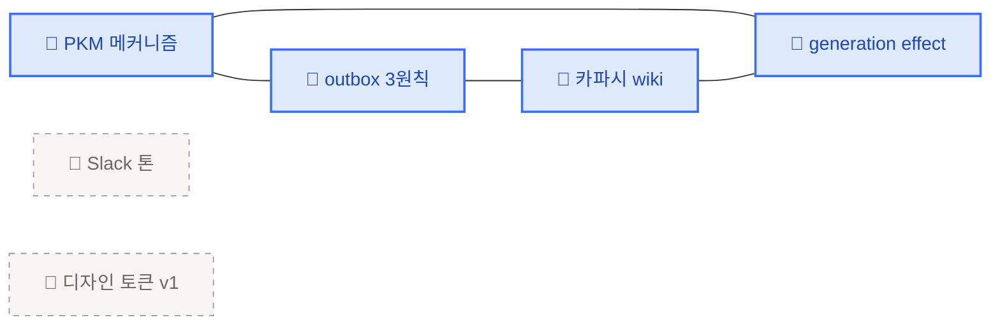
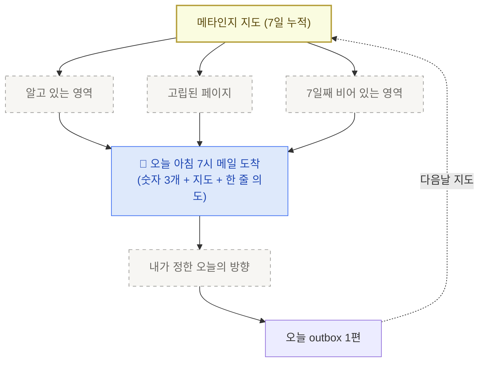

<PageIcon src="/illustrations/page-icons/pi-w2-outbox.png" alt="지식 대시보드 뉴스레터 페이지 아이콘" />

# 6. 지식 대시보드 뉴스레터

> 본인 지식 저장소의 통계·수치·시각화를 매일 아침 메일로 받는 구조입니다. 누적·신규·고립 세 숫자가 본인 받은편지함에 도착합니다.

## 왜 대시보드 뉴스레터인가

PKM(개인 지식관리)의 가장 흔한 실패 패턴은 "본인이 안 보면 죽는다"입니다. 무엇이 막혔는지 알아채는 단서는 글이 아니라 **숫자**에서 옵니다. "이번 주 새 글 0편", "고립 페이지 12개" 같은 한 줄이 본인을 의자에서 일어나게 합니다.

[오늘 한 줄](/retrieve)이 **질적인 사이클**이라면, 대시보드 뉴스레터는 **양적인 거울**입니다. 둘은 한 통의 메일에 같이 도착합니다.

## 메일은 3 블록으로 옵니다

본문은 정해진 3 블록입니다. 더 길지도 짧지도 않게.

<CardGrid columns={3}>
  <Card title="① 어제까지의 나" image="/illustrations/card-yesterday-stats.png">
    누적·신규·고립을 숫자 3개로 봅니다.
  </Card>
  <Card title="② 메타인지 지도" image="/illustrations/card-metacog-map.png">
    `.ai-wiki/` 페이지 그래프 + 비어 있는 영역을 봅니다.
  </Card>
  <Card title="③ 오늘 한 줄" image="/illustrations/card-retrieve-shot.png">
    1줄 의도 + 복붙할 첫 프롬프트를 받습니다.
  </Card>
</CardGrid>

세 블록은 같은 정보를 다른 각도로 보여줍니다. ①은 **얼마**, ②는 **어디가 비어 있나**, ③은 **그래서 오늘 뭘 시작하나**를 짚습니다.

## ① 어제까지의 나 — 숫자 3개

세 가지만 셉니다. 더 늘리면 지도가 대시보드가 됩니다. 핵심은 — **세 숫자가 각각 다른 시점을 잡습니다.** **얼마**(누적) · **지금**(어제) · **어디가 비었나**(고립). 셋이 같이 와야 본인이 어디가 비었는지 스스로 짚게 됩니다.

| 숫자 | 잡는 시점 | 본인에게 묻는 질문 | 어디서 세나 |
|---|---|---|---|
| **누적 outbox** | **전체 흐름** | 7일·30일 단위로 매일 1편을 유지하나? | `outbox/` 폴더의 글 개수 |
| **신규 outbox (어제 +N)** | **바로 어제** | +0이 사흘 이어지면 지금 막혀 있다는 즉답 | 최근 24시간 동안 추가된 `outbox/` 글 수 |
| **고립 페이지** | **연결 상태** | 알고는 있는데 머릿속에서 다른 생각과 안 묶인 자리 | `.ai-wiki/` 안에서 어떤 페이지에서도 참조되지 않은 페이지 수 |

영역 분포는 `.ai-wiki/` 페이지 상단의 메타 정보(카테고리 항목) 또는 파일명 앞부분 키워드로 나눕니다. 도착하는 메일에는 한눈에 보이도록 가로 막대 형태로 옵니다.

```text
📊 영역 분포 (지난 7일, .ai-wiki/ 기준)

PKM 메커니즘      ████████ 4편
운영 DNA          ████ 2편
디자인 토큰       ██ 1편
프롬프트 라이팅   (7일째 비어 있음)
```

같은 영역에 4편이 쌓이는 동안 다른 영역이 7일째 0이라면, 그건 본인이 의식하지 못한 편향입니다. 메타인지의 시작점입니다.

## ② 메타인지 지도 — 고립 페이지

최근 7일 동안 쌓인 `.ai-wiki/` 페이지를 그래프로 그리면 — 서로 인용·링크로 연결된 페이지와, 한 번도 다른 페이지에서 언급되지 않은 **고립 페이지**가 갈립니다.



파란색은 다른 페이지에서 한 번이라도 언급된 페이지(=내 안에서 연결됨), 회색 점선은 7일째 어디에서도 언급되지 않은 페이지(=고립)입니다.

> **고립을 채우는 게 아니라, 고립을 본 다음 본인이 가고 싶은 방향을 정합니다.**
> 인용이 0이라는 건 그 자체로 신호입니다 — 흥미가 안 갔거나, 더 풀 게 없거나, 다음 주에 다시 보고 싶다는 신호일 수 있습니다.

## ③ 오늘 한 줄 — 1줄 의도 + 복붙 프롬프트

마지막 블록은 본인이 오늘 한 줄을 시작하기 위한 첫 손잡이입니다. 예시 — 어제 메일이 이렇게 도착했다고 가정합니다.

<Callout type="tip">
🎯 **오늘 한 줄: "프롬프트 라이팅 영역이 7일째 0이다. 1단락으로 '내가 자주 깨지는 패턴' 한 가지를 짚어 보세요."**

복붙 가능한 첫 프롬프트:

```text
/쓰기 프롬프트 라이팅에서 내가 자주 깨지는 패턴 1가지.
첫 줄 = 주장. 한 단락 안에 풀기.
```
</Callout>

메일은 여기서 끊깁니다. 본인이 그 한 줄을 쓰는 자리는 메일이 아니라 outbox입니다 → 컨셉 자체는 [오늘 한 줄](/retrieve)에서 다뤘습니다.

## 스케줄 거는 법 — `/schedule`

원격 AI 세션(remote agent — 본인 컴퓨터가 아닌 Anthropic 클라우드에서 잠깐 떠서 일하는 별도 세션)을 매일 아침 7시에 한 번 띄워서, 본인 학습 저장소를 가져오고 위 3 블록을 만들어 Gmail로 보냅니다.

### v1 셋업

1. **본인 학습 저장소를 비공개로** 두고 `outbox/`·`.ai-wiki/`를 GitHub에 올려두기 (GitHub 비공개 저장소 = 본인만 볼 수 있는 원격 보관소 — [github.com/new](https://github.com/new)에서 무료로 만듭니다)
2. claude.ai에서 Gmail 연결 켜기 ([https://claude.ai/customize/connectors](https://claude.ai/customize/connectors))
3. `/schedule` 호출 → 아래 표 그대로 답하기

| 항목 | 값 |
|---|---|
| 액션 | `create` |
| 이름 | `오늘 한 줄 메일` |
| 스케줄 | 한국 시간 매일 아침 7시 — `0 22 * * *` 그대로 복붙 |
| 저장소 | `https://github.com/<본인>/my-brain-v1` |
| 모델 | `claude-sonnet-4-6` |
| 연결 도구 | Gmail |

<Toggle title="🔧 `0 22 * * *` 가 왜 7시인지 (cron 표현)">

`0 22 * * *`는 **cron**이라는 오래된 스케줄 표기 방식입니다. 다섯 칸이 각각 **분 · 시 · 일 · 월 · 요일** 순서로 "언제 실행할지"를 잡습니다.

- `0` (분) — 정각 0분에
- `22` (시) — 22시(세계 표준시 UTC 기준)에
- `* * *` (일·월·요일) — 매일

UTC 22시 = 한국 시간(KST) 다음날 오전 7시(UTC+9). 그대로 복붙하면 됩니다. 시간을 바꾸고 싶으면 `시` 칸만 손보면 됩니다 (예: 한국 시간 오전 8시는 `0 23 * * *`).

</Toggle>

<Callout type="warning">
remote agent는 Anthropic 클라우드에서 도는 별도 세션입니다. 본인 컴퓨터의 `~/git/my-brain-v1/`은 보이지 않아요. 그래서 — **본인 학습 저장소는 비공개 GitHub 저장소로 두고 거기서 가져오는(clone — 본인 컴퓨터로 저장소를 복사해오는 git 동작)** 게 v1의 가장 단순한 경로입니다. 워크숍 자료 저장소(`my-learning-agent-workshop`)와 본인 학습 데이터 저장소(`my-brain-v1`)는 분리해서, 자료는 공개로, 학습 데이터는 비공개로 둡니다.
</Callout>

검증은 1주일 돌려보고 — **오늘 한 줄을 쓰게 만들었는가**가 기준입니다. 메일은 도착했는데 outbox에 그날 글이 안 늘면, ①·②의 숫자·시각화가 본인에게 안 맞는 신호입니다.

## 함께 누적되는 형태

지도는 한 번에 그려지지 않습니다. 매일 아침 도착하는 숫자 3개와 한 줄 의도가 7일·30일 단위로 쌓이면서, 본인이 어디에 자주 돌아오고 어디는 한 번 보고 안 돌아왔는지가 드러납니다.



→ 이제 1주일 동안 한 단계씩 굴려봅니다 → [1주일 자율 챌린지](/mission)
