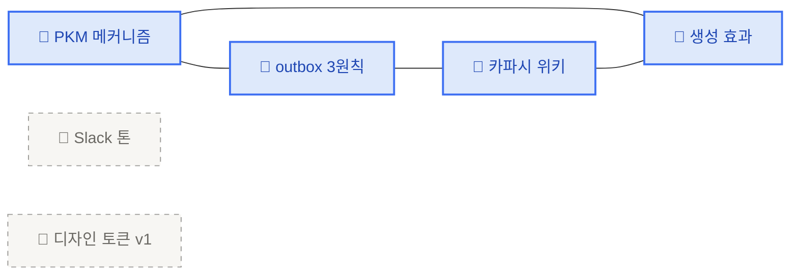

<PageIcon src="/illustrations/page-icons/pi-w2-outbox.png" alt="지식 대시보드 뉴스레터 페이지 아이콘" />

# 6. 지식 대시보드 뉴스레터

> 본인 지식 저장소의 통계·수치·시각화를 메일로 받는 구조입니다. 다룬 / 다루지 못한 / 멈춘 / 연결될 수 있는 지식을 한 화면에서 검토합니다.

## 왜 대시보드 뉴스레터인가

PKM(개인 지식관리)의 가장 흔한 실패 패턴은 "재방문하지 않으면 지식은 멈춘다"입니다. 무엇이 멈췄고 어떤 생각이 연결되지 못하는지는 글이 아니라 **시각화와 숫자**로 훨씬 쉽게 패턴이 잡힙니다. 내가 다룬 지식이 무엇인지, 다루지 못한 지식이 무엇인지, 멈춘 지식이 무엇이고, 어떤 지식들이 연결될 수 있는지를 본인이 직접 검토할 수 있도록 도와주는 거울입니다.

본인이 지식 저장소를 자주 업데이트한다면 매일 메일을 받을 수 있고, 2〜3일 또는 1주일 간격으로도 가능합니다. **처음에는 매일 간격으로 시작해 본인에게 맞는 루틴으로** 맞춰가시면 됩니다.

[오늘 한 줄](/retrieve)이 **질적인 사이클**이라면, 대시보드 뉴스레터는 **양적인 거울**입니다.

## 대시보드에 들어가는 핵심 요소 3가지

PKM 학습 과학에서 검증된 세 축입니다 — **다룸**(Coverage), **흐름**(Momentum), **연결**(Connection). 셋이 같이 와야 어디가 비었는지·어디서 멈췄는지·어디가 끊겨 있는지를 한 화면에서 봅니다.

<CardGrid columns={3}>
  <Card title="① 다룸 (Coverage)" image="/illustrations/card-yesterday-stats.png">
    어떤 영역을 다뤘고 어떤 영역이 비어 있나
  </Card>
  <Card title="② 흐름 (Momentum)" image="/illustrations/card-momentum-uptrend.png">
    최근 쌓이는 속도가 멈췄나
  </Card>
  <Card title="③ 연결 (Connection)" image="/illustrations/card-link-graph.png">
    페이지 사이가 묶이고 있나, 고립돼 있나
  </Card>
</CardGrid>

<Toggle title="🔬 근거 — 세 요소의 PKM 학습 과학 배경">

- **다룸 (Coverage)** — Tiago Forte의 [Building a Second Brain](https://www.buildingasecondbrain.com/book)과 Sönke Ahrens의 [How to Take Smart Notes](https://www.takesmartnotes.com/)가 공통적으로 짚는 "지식 영역 매핑" 단계. 다루지 못한 영역을 시각화하는 게 메타인지의 시작입니다.
- **흐름 (Momentum)** — [Karpicke & Roediger (2008), Science](https://www.science.org/doi/10.1126/science.1152408)의 인출 연습 연구. 자료를 모으는 것보다 **꺼내 쓰는 빈도**가 장기 기억을 결정합니다. 흐름이 멈추면 PKM 자체가 죽습니다.
- **연결 (Connection)** — Niklas Luhmann의 [Zettelkasten](https://en.wikipedia.org/wiki/Zettelkasten)(독일 사회학자 루만이 평생 쌓은 카드 노트 시스템 — 노트 간 링크를 가장 중요한 자산으로 봅니다)과 Ahrens(2017)가 강조하는 노트 간 링크 밀도. 고립 노트는 다시 꺼내질 가능성이 낮습니다.

</Toggle>

## ① 다룸 (Coverage) — 영역 분포

본인 저장소가 어떤 영역을 다뤘고 어떤 영역이 비어 있는지 한눈에 봅니다. 영역은 `.ai-wiki/` 페이지 상단의 메타 정보(카테고리 항목) 또는 파일명 앞부분 키워드로 나눕니다.

| 영역 | 편수 | 분포 |
|---|---|---|
| PKM 메커니즘 | **4편** | 🟩🟩🟩🟩 |
| 운영 DNA | **2편** | 🟩🟩 |
| 디자인 토큰 | **1편** | 🟩 |
| 프롬프트 라이팅 | **0편** | ⬜️ _7일째 비어 있음_ |

같은 영역에 4편이 쌓이는 동안 다른 영역이 7일째 0이라면, 그건 본인이 의식하지 못한 편향입니다. 메타인지의 시작점입니다.

<Toggle title="📬 실제 클로드 코드가 만드는 결과물은 어떻게 생겼나">

원격 세션이 본인 저장소를 읽고 `outbox/`·`.ai-wiki/` 파일 개수를 센 다음, 받는 채널(Gmail / Slack)에 맞춰 모양을 다르게 만듭니다. 셋 다 **같은 숫자**를 보여주지만, 채널 특성에 맞춰 형식이 달라집니다.

**1️⃣ Gmail — 색·표가 들어간 메일 (HTML 메일)**

본인 메일함에서는 이렇게 도착합니다. 웹페이지처럼 색·표가 같이 들어가서 가로 막대 비율이 한눈에 잡힙니다.

```html
<h2>📊 다룸 — 영역 분포 (지난 7일)</h2>
<table style="width:100%; border-spacing:0 8px;">
  <tr>
    <td style="width:30%;">PKM 메커니즘</td>
    <td><div style="background:#3D6FF2; width:100%; height:14px;"></div></td>
    <td style="text-align:right; padding-left:8px;"><b>4편</b></td>
  </tr>
  <tr>
    <td>운영 DNA</td>
    <td><div style="background:#3D6FF2; width:50%; height:14px;"></div></td>
    <td style="text-align:right; padding-left:8px;"><b>2편</b></td>
  </tr>
  <tr>
    <td style="color:#9b9a97;">프롬프트 라이팅</td>
    <td><div style="background:#e9e7e0; width:8%; height:14px;"></div></td>
    <td style="text-align:right; padding-left:8px; color:#9b9a97;">0편 · 7일째</td>
  </tr>
</table>
```

**2️⃣ Slack — 메시지 (이모지 막대 + 굵은 글씨)**

슬랙에서는 메시지 한 줄로 압축됩니다. 이모지가 막대 역할을 합니다.

```
📊 *다룸 — 영역 분포 (지난 7일)*

`PKM 메커니즘`      🟦🟦🟦🟦🟦🟦🟦🟦   *4편*
`운영 DNA`           🟦🟦🟦🟦              *2편*
`디자인 토큰`        🟦🟦                  *1편*
`프롬프트 라이팅`    ⬜️⬜️⬜️⬜️⬜️⬜️⬜️⬜️   _0편 · 7일째 비어 있음_
```

**3️⃣ 첨부 차트 — 본인이 더 시각적으로 보고 싶을 때**

`/schedule` 프롬프트에 "분포를 PNG로 만들어 첨부"를 추가하면, 원격 세션이 그래프 그리는 도구를 골라 이미지로 그린 다음 메일에 붙입니다. 막대 외에 도넛·트리맵으로도 그릴 수 있습니다.

→ **셋 중 본인이 매일 확인하는 채널에 맞는 모양을 고르면 됩니다.** 처음에는 메일 한 가지로 시작하시는 게 가장 단순합니다.

</Toggle>

## ② 흐름 (Momentum) — 누적·신규·멈춤 신호

쌓이는 속도가 멈췄는지 두 숫자로 봅니다. **누적**은 전체 흐름, **신규**는 어제 / 지난 7일의 변화량.

| 숫자 | 잡는 시점 | 본인에게 묻는 질문 | 어디서 세나 |
|---|---|---|---|
| **누적 outbox** | 전체 흐름 | 7일·30일 단위로 매일 1편을 유지하나? | `outbox/` 폴더의 글 개수 |
| **신규 outbox (어제 +N)** | 바로 어제 | +0이 사흘 이어지면 지금 막혀 있다는 즉답 | 최근 24시간 동안 추가된 `outbox/` 글 수 |

## ③ 연결 (Connection) — 페이지 그래프 + 고립

최근 7일 동안 쌓인 `.ai-wiki/` 페이지를 그래프로 그리면 — 서로 인용·링크로 연결된 페이지와, 한 번도 다른 페이지에서 언급되지 않은 **고립 페이지**가 갈립니다.



파란색은 다른 페이지에서 한 번이라도 언급된 페이지(=내 안에서 연결됨), 회색 점선은 7일째 어디에서도 언급되지 않은 페이지(=고립)입니다.

> **고립을 채우는 게 아니라, 고립을 본 다음 본인이 가고 싶은 방향을 정합니다.**
> 인용이 0이라는 건 그 자체로 신호입니다 — 흥미가 안 갔거나, 더 풀 게 없거나, 다음 주에 다시 보고 싶다는 신호일 수 있습니다.

→ 이 데이터를 들고 다음 한 줄을 적는 행위 자체는 [오늘 한 줄](/retrieve)에서 다룹니다.

## 스케줄 거는 법 — `/schedule`

원격 AI 세션(본인 컴퓨터가 아닌 Anthropic 클라우드에서 잠깐 떠서 일하는 별도 세션)을 정한 시점에 띄워서, 본인 학습 저장소를 가져오고 위 세 요소(다룸·흐름·연결)를 만들어 Gmail 또는 Slack으로 보냅니다.

### v1 셋업

1. **본인 학습 저장소를 비공개로** 두고 `outbox/`·`.ai-wiki/`를 GitHub에 올려두기 (GitHub 비공개 저장소 = 본인만 볼 수 있는 원격 보관소 — [github.com/new](https://github.com/new)에서 무료로 만듭니다)
2. claude.ai에서 받을 채널 연결 켜기 ([https://claude.ai/customize/connectors](https://claude.ai/customize/connectors)) — **Gmail** 또는 **Slack** 중 본인이 매일 확인하는 채널 하나를 선택합니다
3. `/schedule` 호출 → 다음 네 가지를 그대로 답하기:
   - **시각** — 한국 시간 매일 아침 7시 (`0 22 * * *` 그대로 복붙, 아래 토글 참고)
   - **저장소** — `https://github.com/<본인>/my-brain-v1`
   - **모델** — `claude-sonnet-4-6` 그대로 복붙
   - **받을 곳** — Gmail 또는 Slack

<Toggle title="📮 Gmail vs Slack — 어떻게 고르나">

- **Gmail** — 출근 전 메일함을 먼저 여는 분. 메일은 본문이 길어도 읽기 좋고, 보관도 자동입니다.
- **Slack** — 메일보다 슬랙을 더 자주 보는 분. 메시지 길이는 짧게 압축됩니다. 본인 DM(`나에게`) 또는 학습용 비공개 채널로 보내면 노이즈가 적습니다.

처음에는 본인이 **매일 확인하는 채널**로 하나만 켭니다. 둘 다 켜면 어느 쪽도 안 봅니다.

</Toggle>

<Toggle title="🔧 `0 22 * * *` 가 왜 7시인지 (cron 표현)">

`0 22 * * *`는 **cron**이라는 오래된 스케줄 표기 방식입니다. 다섯 칸이 각각 **분 · 시 · 일 · 월 · 요일** 순서로 "언제 실행할지"를 잡습니다.

- `0` (분) — 정각 0분에
- `22` (시) — 22시(세계 표준시 UTC 기준)에
- `* * *` (일·월·요일) — 매일

UTC 22시 = 한국 시간(KST) 다음 날 오전 7시(UTC+9). 그대로 복붙하면 됩니다. 시간을 바꾸고 싶으면 `시` 칸만 손보면 됩니다 (예: 한국 시간 오전 8시는 `0 23 * * *`).

</Toggle>

<Toggle title="📅 빈도 — 매일 / 격일 / 주 1회 중 본인 페이스에 맞게">

`/schedule`의 스케줄 칸을 바꿔서 메일 빈도를 조절합니다. 처음에는 매일이 추천이고, 안정되면 본인 페이스에 맞춥니다.

| 빈도 | cron 표현 | 권장 시점 |
|---|---|---|
| 매일 | `0 22 * * *` | 시작 시점 — 패턴이 잡히기 전까지 |
| 격일 (월·수·금) | `0 22 * * 1,3,5` | 본인이 PKM에 익숙해진 뒤 |
| 주 1회 (월요일) | `0 22 * * 1` | 본인 페이스가 안정된 뒤 |

요일은 cron의 5번째 칸에서 `0`(일)〜`6`(토)으로 잡습니다. 한 번 등록한 일정은 `/schedule list`로 확인하고, `/schedule update`로 빈도만 바꿀 수 있습니다.

</Toggle>

<Toggle title="❓ 원격 세션이 내 저장소 파일을 읽고, 메일/슬랙을 보내는 게 가능한가">

가능합니다. 그게 정확히 `/schedule`이 동작하는 방식입니다.

원격 세션은 Anthropic 클라우드에서 잠깐 떠서 돌아가는 별도 컴퓨터입니다. 본인 노트북이 꺼져 있어도 동작합니다. 두 가지를 본인이 미리 켜두면 됩니다.

| 동작 | 어떻게 가능한가 |
|---|---|
| 본인 저장소 파일 읽기 | `/schedule` 호출 시 본인 GitHub 저장소 주소를 넣으면, 원격 세션이 시작할 때 그 저장소를 자기 작업 폴더로 가져옵니다(clone). `outbox/`·`.ai-wiki/` 파일을 그 안에서 읽습니다. 비공개 저장소라도 GitHub 권한 한 번만 허용하면 됩니다. |
| 메일·슬랙 메시지 보내기 | claude.ai의 `connectors` 페이지에서 Gmail 또는 Slack을 본인 계정에 연결해두면, 원격 세션이 본인 대신 그 채널로 메시지를 보낼 수 있습니다. |

**단, 본인 노트북 안의 폴더(`~/git/my-brain-v1/`)는 못 봅니다.** 원격 세션과 본인 컴퓨터는 다른 공간이라, 본인 컴퓨터에만 있고 GitHub에 안 올린 파일은 보이지 않습니다. 그래서 학습 저장소를 GitHub에 비공개로 올려두는 게 v1의 가장 단순한 경로입니다.

워크숍 자료 저장소(`my-learning-agent-workshop`)와 본인 학습 데이터 저장소(`my-brain-v1`)는 분리해서, 자료는 공개로, 학습 데이터는 비공개로 둡니다.

</Toggle>

검증은 1주일 돌려보고 — **본인이 한 줄을 더 적게 만들었는가**가 기준입니다. 메일은 도착했는데 outbox에 그날 글이 안 늘면, 세 요소의 시각화가 본인에게 안 맞는 신호입니다.

## 함께 누적되는 형태

지도는 한 번에 그려지지 않습니다. 매일·격일·주간 단위로 도착하는 세 요소가 7일·30일 단위로 쌓이면서, 본인이 어디에 자주 돌아오고 어디는 한 번 보고 안 돌아왔는지가 드러납니다.


→ 이제 1주일 동안 한 단계씩 굴려봅니다 → [1주일 자율 챌린지](/mission)
