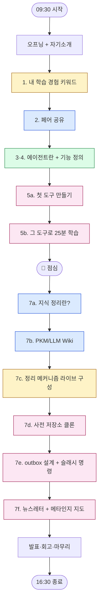

# 타임테이블

> 6시간(09:30〜16:30)을 어떻게 쪼개 쓰는지 한 장. 오전은 자기경험 → 첫 도구, 오후는 저장소 → 뉴스레터.

## 한 장 요약

| 시간 | 블록 | 목표 |
|---|---|---|
| 09:30〜09:45 | 오프닝 + 자기소개 | 워크숍 그림, 인사 |
| 09:45〜09:55 | 1. 학습 경험 키워드 (개인) | 효과적/비효과적 + 차이 키워드 회고 |
| 09:55〜10:10 | 2. 페어 공유 | 키워드 교환 + AI 학습 적용 사례 |
| 10:10〜10:40 | 3·4. 에이전트란 + 내 학습 에이전트 기능 (그룹) | 에이전트 정의를 본인 needs에서 도출 |
| 10:40〜10:50 | 휴식 | |
| 10:50〜11:05 | 5a. 첫 도구 만들기 | Claude Project + 시스템 프롬프트 1장 |
| 11:05〜11:30 | 5b. 그 도구로 25분 학습 | 외부 자료 1건 가져오기 포함 |
| 11:30〜12:30 | 🍱 점심 | |
| 12:30〜12:40 | 재집결 + 환경 점검 | Claude Code 설치 확인 |
| 12:40〜12:55 | 7a. 지식 정리란? (회상) | 세컨드 브레인 등 본인 경험 |
| 12:55〜13:20 | 7b. PKM/LLM Wiki 강의 + 페어 토크 | 카파시·김창준·PKM/PIM 차이 |
| 13:20〜13:45 | 7c. 정리 메커니즘 라이브 구성 | 본인 커스텀 강조 |
| 13:45〜14:00 | 휴식 | |
| 14:00〜14:20 | 7d. 사전 저장소 클론 + 점검 | Claude Code에서 저장소 열기 |
| 14:20〜15:10 | 7e. outbox 설계 + 데이터 + 슬래시 명령 | `/오늘정리`, `/외부자료-가져오기` |
| 15:10〜15:20 | 휴식 | |
| 15:20〜16:00 | 7f. 뉴스레터 스케줄 + 메타인지 지도 | `/schedule` routine 활성화 |
| 16:00〜16:30 | 발표·회고·마무리 | 1분 시연 + 회고 |

## 색 코드

- 🟡 **개인 작업** — 1번 키워드 회고, 7c 메커니즘 구성
- 🔵 **페어 공유** — 2번, 7a, 7b
- 🟢 **그룹 토론** — 3·4번
- 🟣 **만들기·실습** — 5a, 5b, 7d, 7e, 7f

## 흐름 도식

## 오후 본진 = 학습 단원 5개

오후 7a〜7f는 [학습 단원](/workshop) 5개로 깊게 정리돼 있습니다.

<CardGrid columns={2}>
  <Card title="1. 지식을 잘 정리한다는건 뭘까?" icon="🪶" href="/workshop/knowledge" meta="7a + 7b">
    회상 + 외부 모델 짚기. PKM/PIM·카파시 LLM Wiki·김창준 PKM.
  </Card>
  <Card title="2. 나·LLM·저장소 삼자간의 협업 관계" icon="📐" href="/workshop/mechanism" meta="7c">
    내가 쓴 글이 학습을 만들고, 시간순 평문이 LLM이 읽는 토대가 된다.
  </Card>
  <Card title="3. 저장소 셋팅" icon="🗂️" href="/workshop/setup" meta="7d">
    초안 저장소 clone + `.claude/commands/` 자동 로드.
  </Card>
  <Card title="4. outbox 설계 + 데이터 + 커맨드" icon="📤" href="/workshop/outbox" meta="7e">
    본인 데이터를 `.inbox/`에 넣고 `/돌아보기`로 outbox 만들기.
  </Card>
</CardGrid>

<Card title="5. 꺼낼 한 줄" icon="🎯" href="/workshop/retrieve" meta="7f · 매일 아침 v1">
  `/schedule`로 매일 아침 outbox·`.ai-wiki`를 읽고 숫자 3개 + 오늘 꺼낼 한 줄을 본인에게 보냄.
</Card>
