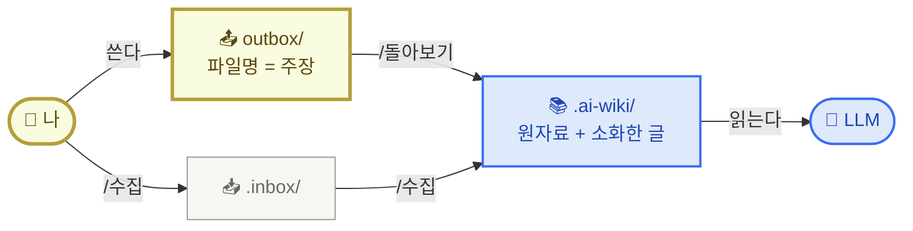
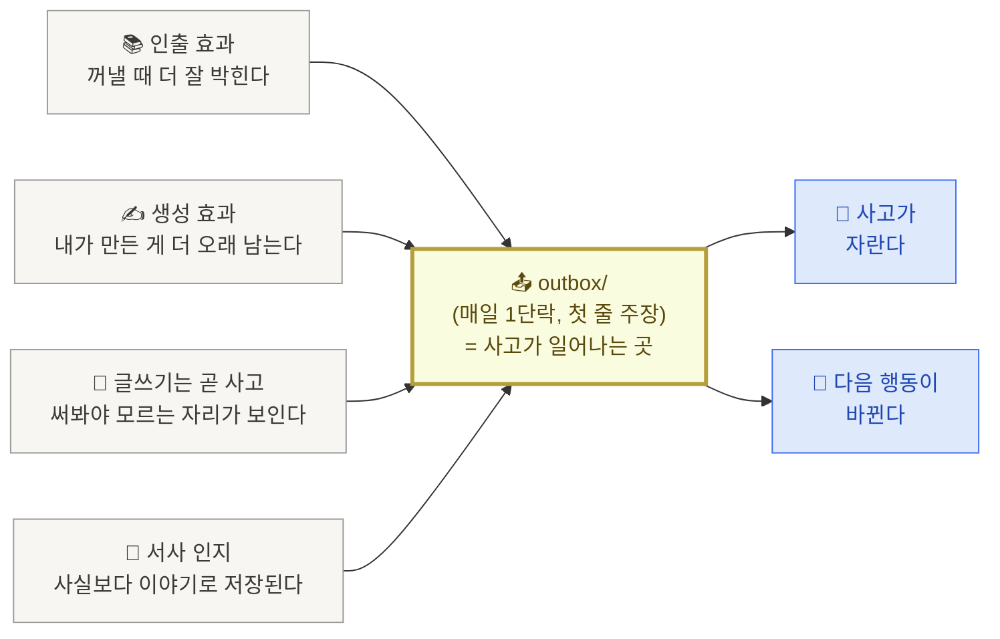

<PageIcon src="/illustrations/page-icons/pi-w2-mechanism.png" alt="삼자간의 협업 페이지 아이콘" />

# 3. 나·LLM·저장소 삼자간의 협업 관계

> 지난 페이지에서 우리는 지식을 단순히 모으는 것(PIM, 자료 정리)과, 모은 자료가 내 사고로 이어지게 만드는 것(PKM, 지식 활용)이 어떻게 다른지를 짚었습니다.

이번 페이지가 풀고 싶은 질문은 하나입니다.

**나·LLM·지식 저장소 셋이 협업이 잘 되려면, 무엇이 중요할까?**

답을 미리 한 줄로 적어두면 이렇습니다 — **사람에게 학습이 잘 일어나는 방식과 LLM에게 학습이 잘 일어나는 형식은 실제로 다르다. 그래서 한 저장소 안에 두 영역을 둔다. 사람은 `outbox/`에 쓰면서 학습하고, `.ai-wiki/`는 LLM이 읽기 좋게 커맨드가 자동으로 채운다.** 오늘의 한 줄 목표가 "내 `outbox/`에 글 1개 쌓는다"인 이유도 여기 있습니다.

아래 세 단계로 풀어 봅니다.

## 1) 핵심 메커니즘 — 한 저장소에 두 영역

<SectionSlide n={1} />

세 주체가 협업한다고 했지만, 골격은 단순합니다. 한 저장소 안에 두 자리를 둡니다 — **사람이 쓰는 자리(`outbox/`)와 AI가 읽을 자리(`.ai-wiki/`)**.

- **`outbox/` — 내가 쓰는 자리.** 본인에게 맞는 분류·파일명 자유. 쓰는 동안 학습이 일어납니다. 다듬지 않은 원자료(노션 페이지·URL·AI 산출물)는 옆에 `.inbox/`로 던집니다 — `/수집` 한 줄로 쌓입니다.
- **`.ai-wiki/` — AI가 읽는 자리.** 사람이 직접 손대지 않습니다. `/돌아보기`·`/수집` 커맨드(슬래시 한 줄로 부르는 단축 명령)가 `outbox/`와 `.inbox/`의 내용을 LLM이 읽기 좋게 자동 복사합니다.

<Callout type="note">
점(`.`)으로 시작하는 폴더는 **커맨드가 자동 관리**합니다. 매일 손이 가는 자리는 `outbox/` 한 곳. 골격은 시작 세트 저장소 [imakerjun/my-brain-v1](https://github.com/imakerjun/my-brain-v1)에 들어가 있고, [셋팅](/setup)에서 같이 깝니다.
</Callout>

<SectionSlide n={2} />

이 구조에서 잊지 말 두 가지 약속이 있습니다.

1. **사람은 `outbox/`에만 쓰고, `.ai-wiki/`는 손대지 않습니다.** AI가 정리해준 글을 그대로 옮겨 붙이면 받아 적은 셈이라 학습이 안 일어납니다. 어디까지 사람이 쓰고 어디부터 AI에 넘길지는 [바로 아래 outbox 경계](#outbox-경계--단락은-내가-다듬기는-ai)에서 풉니다.
2. **`outbox/`·`.inbox/`는 한 번 쓰면 고치지 않습니다.** 어제 어디서 막혔는지가 그대로 남아 있어야 다음 글의 재료가 됩니다. `.ai-wiki/`는 커맨드 호출 때마다 자동으로 새로 정리되는 복제본이라 신경 쓸 필요 없습니다.

### outbox 경계 — 단락은 내가, 다듬기는 AI

<SectionSlide n={3} />

> **"AI한테 다시 써줘"는 PIM, "내가 약한 부분 짚어줘"는 PKM.**

현실적으로 내가 쓴 글을 AI한테 맞춤법 받고 문장 다듬는 경우가 많습니다. 어디까지 AI에 넘겨야 outbox의 학습 효과가 살아남을까. **내가 만든 정보가 받아 적은 정보보다 더 잘 기억된다**는 학습 연구 결과에서 답이 나옵니다. 학습은 **글자 단위**가 아니라 **하나의 의미 덩어리를 내가 직접 만들었는가**에서 갈립니다.

한 줄 룰 — **단락 초안과 첫 줄 주장은 내 손으로 (다듬기조차 AI 금지), 맞춤법·문장 흐름은 AI에 맡깁니다.**

| 작업 | 누가 | 이유 |
|---|---|---|
| 단락 단위 초안 | **나** | 내가 만든 정보가 더 잘 기억됨 |
| 첫 줄 주장 만들기 | **나** | 틀려도 OK. 단 구체적이어야 사고가 일어남 |
| 단락 구조 재배치 | **나** | 사고의 흐름 = 내 판단 |
| 맞춤법·문법 | AI | 학습과 무관한 머리 피로 |
| 문장 흐름 다듬기 | AI | 메시지는 내가 정했으니 표현만 |
| 단어 교체·동의어 | AI | 의미는 내가 잡고 어휘만 |

AI 부르는 방식 — **"이거 다시 써줘" X / "내가 약한 부분 짚어줘 · 반박해봐" O.** AI가 약점을 짚으면 결국 내가 다시 쓰게 되고, 같은 outbox 위에서 학습이 두 번 일어납니다.

<Toggle title="⚠️ 흔한 함정 — 단락 통째로 AI에 던지기">
"더 좋게 다듬어줘"라고 단락 통째로 던지는 패턴입니다. 결과물은 깔끔해지지만 **내가 어디서 막혔는지**가 outbox에서 지워집니다. 1주일 뒤 다시 봐도 내 사고의 흔적이 안 남고, [안드레 카파시](https://karpathy.github.io/)의 LLM wiki(LLM이 읽기 좋게 정리된 개인 위키) 외형만 갖춘 자료 정리(PIM) 상태가 됩니다.
</Toggle>

### 카파시 LLM Wiki 패턴 — 우리 폴더와 매핑

`.inbox/`와 `.ai-wiki/`의 출처는 [안드레 카파시의 LLM 위키](/appendix)입니다 ([2. 지식 정리에서 카파시 단원](/knowledge#방법--안드레-카파시--llm-wiki)을 이미 짚었습니다). 질문할 때마다 검색해서 답을 만드는 방식 대신, **LLM이 직접 마크다운 위키를 만들고 매번 새로 갱신**하는 패턴입니다. 사람은 자료를 던지고 질문만 하고, LLM은 페이지를 쓰고 페이지끼리의 연결을 유지합니다.

**3 레이어 — 카파시의 3층 모델이 우리 폴더에 어떻게 떨어지나**

| 레이어 | 우리 폴더 | 누가 쓰나 |
|---|---|---|
| **원본 자료** | `.inbox/` | 사람. PR(코드 변경 요청)·노션·노트·AI 요약을 던져넣기만 합니다. 수정 X. `/수집` 커맨드가 한 줄로 던지는 자리. |
| **위키** | `.ai-wiki/` | LLM. `/수집`(원본 표시)과 `/돌아보기`(소화한 글 표시)가 호출될 때마다 새로 채웁니다. 사람은 직접 안 만집니다. |
| **운영 규칙** | `CLAUDE.md` + `.claude/commands/{쓰기·수집·돌아보기·주간정리}.md` | 사람+LLM. 폴더 규칙과 흐름을 정의합니다. |

**3 동작 — 들이기 · 묻기 · 점검**

카파시가 정리한 **위키의 세 동작**입니다. 우리 구현은 4개 커맨드가 나눠 맡습니다.

| 동작 | 무엇인가 | 우리 구현 |
|---|---|---|
| **들이기** (Ingest) | 새 자료를 위키에 녹입니다 | `/수집 <URL\|텍스트>` 한 줄 → `.inbox/`에 원본 그대로 저장 + `.ai-wiki/`에 "원본"으로 복사. 본인이 소화해 쓴 글은 `outbox/`에 들어가는데, `/쓰기`가 3원칙 골격을 깔고 본인이 본문을 채우면 `/돌아보기`가 "소화한 글"로 `.ai-wiki/`에 동기화합니다. |
| **묻기** (Query) | 위키에 질문합니다 | `/돌아보기`가 `.ai-wiki/`의 두 종류 자료를 함께 읽고 다음 outbox 골격 한 편(주장·액션·근거 3줄)을 제안합니다. 본인은 받아 적지 않고 한 줄씩 검토합니다. |
| **점검** (Lint) | 위키 건강을 검진합니다 | 아직 X. `.ai-wiki/` 안의 고립 페이지·모순·낡은 주장을 점검하는 건 다음 주 후보(`/약점짚기` 등)입니다. |

<Callout type="tip">
사람이 위키를 포기하는 이유는 **유지보수 부담**입니다. LLM은 지치지 않고, 페이지 사이 연결을 잊지 않고, 한 번에 15개 파일을 손봅니다. 유지보수 비용이 0에 가까워지니 위키가 살아남습니다.
</Callout>

## 2) 왜 `outbox/`가 중심인가

<SectionSlide n={4} />

지금까지 알려진 여러 지식 관리 방법론 — [안드레 카파시](https://karpathy.github.io/)의 LLM wiki, [PARA](https://fortelabs.com/blog/para/), [ACE](https://blog.linkingyourthinking.com/notes/ace-folder-framework), [Zettelkasten](https://en.wikipedia.org/wiki/Zettelkasten) — 이름은 다 다르지만, 학습 과학으로 거슬러 올라가면 같은 결론에 모입니다.

> **학습이 일어나는 곳은 "읽기·저장"이 아니라 "쓰기·인출"이다.**

이걸 뒷받침하는 학습 효과가 네 가지 있습니다. 모두 `outbox/` 쪽에 무게를 실어주는 연구들입니다.

위 도식의 4개 효과를 구체적인 무게와 함께 한 줄씩 짚어보면 —

- **인출 효과** — 자료를 100번 다시 읽는 것보다, 한 줄이라도 내 말로 다시 적어내는 게 기억에 약 1.5〜2배 더 오래 남습니다.
- **생성 효과** — LLM이 정리해준 요약을 그대로 복사해 붙이면 깔끔해 보여도 학습은 안 일어납니다. 한 줄씩 손으로 옮겨 적어야 박힙니다.
- **글쓰기 = 사고** — 머릿속에서 흐릿하게 알던 것이 글로 옮기면서 정리되고, 모르는 자리가 드러납니다 ("잘 안다고 생각했던 것도 글로 써보면 생각만큼 모른다", Paul Graham).
- **서사 인지** — 결정이 일어난 시점, 판단이 바뀐 시점, 불편했던 대화를 **한 단락 이야기로** 풀어내야 한 달 뒤에도 살아남습니다. 기억은 사실 진술보다 이야기 단위로 저장됩니다.

<Toggle title="🔬 근거 — 학습 과학 연구 4개">

- **인출 효과** — [Karpicke & Roediger 2008 · *Science*](https://www.science.org/doi/10.1126/science.1152408). 2006년 실험에서 시험(인출)을 본 학생이 같은 시간 동안 다시 읽기만 한 학생보다 장기 기억이 1.5〜2배 강했습니다.
- **생성 효과** — [Slamecka & Graf 1978 · 원 논문](https://doi.org/10.1037/0278-7393.4.6.592). "직접 만들어낸 정보는 받아 적은 정보보다 기억에 더 잘 남는다"가 처음 보고된 효과.
- **글쓰기 = 사고** — Sönke Ahrens **[How to Take Smart Notes](https://www.takesmartnotes.com/)** 와 Paul Graham 에세이 **["Putting Ideas into Words"](http://paulgraham.com/words.html)**.
- **서사 인지** — 인지심리학자 [Jerome Bruner](https://en.wikipedia.org/wiki/Jerome_Bruner)와 의사결정 연구자 [Gary Klein](https://en.wikipedia.org/wiki/Gary_Klein)이 공통적으로 발견한 사실. 기억이 명제보다 서사 단위로 저장된다.

</Toggle>

<Callout type="tip">
`.inbox/`에 매달리면 PIM에 빠집니다. 자료 수집에 석 달, 내 글은 한 줄도 안 쓰는 패턴. PKM의 본질은 **내가 쓴 한 줄(`outbox/`)** 에 있고, `.inbox/`는 그 한 줄을 만들기 위한 재료일 뿐입니다.
</Callout>

## 3) `outbox/` 한 글의 형식 — 3원칙

앞에서 `outbox/`(사람이 쓰는 자리)와 `.ai-wiki/`(AI가 읽을 자리) 두 곳으로 나눴으니, 이제 사람이 직접 쓰는 `outbox/`에 어떤 형식으로 글을 쓰면 좋을지를 정리할 차례입니다. **사람이 다시 읽고 학습하기 위한 글 한 편의 형식 3가지**를 짚습니다.

<CardGrid columns={3}>
  <Card title="첫 줄 = 강력한 주장" image="/illustrations/card-bold-claim.png">
    틀려도 OK. 단 구체적인 한 줄이어야 어디서 막히는지 본인에게 드러납니다.
  </Card>
  <Card title="파일명 = 인출 단서" image="/illustrations/card-magnifier.png">
    파일명만 봐도 무슨 글인지 잡혀야 다음에 다시 꺼낼 수 있습니다.
  </Card>
  <Card title="내 생각 first" image="/illustrations/card-one-note.png">
    내 생각을 먼저 쓰고, AI 도움을 받되 outbox의 글은 내가 확장해 나갑니다.
  </Card>
</CardGrid>

<Toggle title="🎯 '주장 = 한 줄 결론'이 파일명에 어떻게 박히나 (예시 4쌍)">

'주장'은 거창하게 들리지만 풀면 단순합니다. **내가 도달한 한 줄짜리 결론**입니다. 명사 한 토막(❌)이 아니라, **"…이다 / …해야 한다"로 끝나는 한 문장**(✅)으로 적습니다. 한 노트는 하나의 주장만 담아야 다음에 다시 꺼내 쓰입니다.

| ❌ 주제 카테고리 (큰 묶음 폴더) | ✅ 주장이 담긴 노트 (한 장에 한 주장) |
|---|---|
| `PKM` | `pkm은-도구가-아니라-메커니즘이다` |
| `학습-에이전트` | `에이전트는-기능-묶음이-아니라-나를-대신해-결정하는-정책이다` |
| `프롬프트-엔지니어링` | `시스템-프롬프트는-페르소나가-아니라-제약조건의-집합이다` |
| `효과적인-학습` | `외부화하지-않으면-학습은-회상에-머문다` |

(파일명 끝의 `.md`는 마크다운 파일 확장자라 생략했습니다)

차이의 본질은 길이가 아니라 **문장 끝에 판단이 박혀 있느냐**입니다. ❌ 칸은 명사로 끝나서 안에 뭐든 쌓이고, ✅ 칸은 "…이다 / …해야 한다"가 박혀서 이 문장에서 벗어나면 파일명을 배신하는 글이 됩니다. 한 노트에 하나의 주장만 담으라는 원칙이 파일명 차원에서 자동으로 강제되는 셈입니다.

</Toggle>

<Callout type="info">
🎯 **첫 줄 주장은 정답이 아니어도 OK. 단 구체적이어야 합니다.**

"에이전트로 PKM을 만들 수 있다"는 본인이 잘 모르는 상태에서도 박을 수 있는 주장입니다. 글을 쓰는 동안 "잠깐, 에이전트랑 LLM 단순 호출이 뭐가 다르지?"가 드러나고, 그 막힘이 다음 글의 주제가 됩니다.

반대로 "에이전트는 유용하다"는 틀릴 수가 없어서 사고가 안 일어납니다.

틀린 주장이 본인 학습 지도를 더 정확하게 그려줍니다. 다음 `/돌아보기`가 그 주장을 다시 꺼내 본인이 고치는 흐름이 v1의 학습 루프입니다.
</Callout>

<Callout type="tip">
🎯 **"오늘, 내 `outbox/`에 글 1개 쌓는다."**
3원칙대로 쓴 1단락이면 충분합니다. 그 1글이 다음 `/돌아보기`의 첫 입력이 됩니다.
</Callout>

→ 다음: [저장소 셋팅](/setup)
