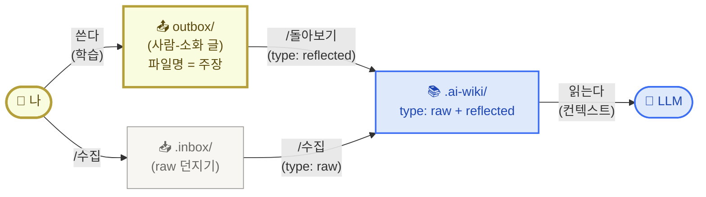
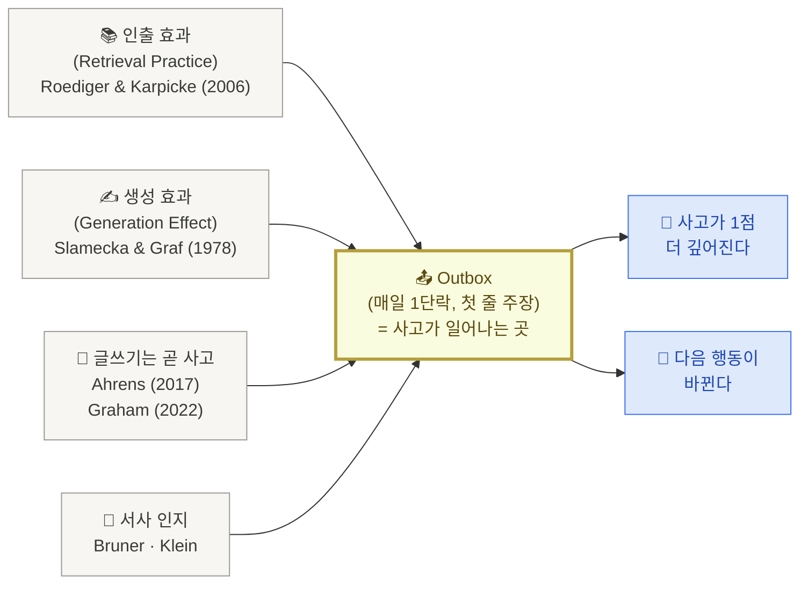

<PageIcon src="/illustrations/page-icons/pi-w2-mechanism.png" alt="삼자간의 협업 페이지 아이콘" />

# 2. 나·LLM·저장소 삼자간의 협업 관계

> 지난 페이지에서 우리는 지식을 단순히 모으는 것(PIM)과, 모은 자료가 내 사고로 이어지게 만드는 것(PKM)이 어떻게 다른지를 짚었습니다.

이번 페이지가 풀고 싶은 질문은 하나입니다.

**나·LLM·지식 저장소 셋이 협업이 잘 되려면, 무엇이 중요할까?**

답을 미리 한 줄로 적어두면 이렇습니다 — **사람에게 학습이 잘 일어나는 방식과 LLM에게 학습이 잘 일어나는 형식은 실제로 다르다. 그래서 한 저장소 안에 두 영역을 둔다. 사람은 `outbox/`에 쓰면서 학습하고, `.ai-wiki/`는 LLM이 읽기 좋게 커맨드가 자동으로 채운다.** 오늘의 한 줄 목표가 "내 Outbox에 글 1개 쌓는다"인 이유도 여기 있습니다.

아래 세 단계로 풀어 봅니다.

## 1) 핵심 메커니즘 — 한 저장소에 두 영역

<SectionSlide n={1} />

세 주체가 협업한다고 했지만, 그 골격은 의외로 단순합니다. 두 영역으로 자리를 나누면 정리됩니다.

- **사람용 영역 `outbox/`** — 내가 직접 쓰는 자리. **본인에게 맞는 분류**와 의미 있는 파일명으로(ACE·PARA·날짜·주제 등 자유). 쓰는 동안 학습이 일어나는 자리라, 사람이 보고 찾고 다시 꺼내 쓰기 좋은 형식이 우선.
- **AI용 영역 `.ai-wiki/`** — `/돌아보기`(사람-소화 글의 `outbox/` 복제)와 `/수집`(`.inbox/` raw 자료의 미러)이 함께 채우는 자리. 시간순 평문 `YYYY-MM-DD-주제.md` 파일이 한 폴더에 평면으로. 모든 파일에 frontmatter `type`이 박혀 raw인지 사람-소화인지 한눈에 구분. LLM이 컨텍스트로 한꺼번에 끌어와 읽기 좋은 형식이 우선.

두 영역 사이는 **자동 동기화**가 책임집니다. 사람은 `outbox/`에 글을 쓰고 `.inbox/`에 raw 자료를 던지기만 하면 됩니다. `/돌아보기`·`/수집` 커맨드가 두 자리를 `.ai-wiki/`로 동기화합니다. 사람에게 학습이 잘 일어나는 방식과 LLM에게 학습이 잘 일어나는 형식이 실제로 다르다는 것을 인정하고, 같은 자료를 두 가지 view로 나눈 셈입니다.

<Callout type="note">
실제 starter는 [imakerjun/my-brain-v1](https://github.com/imakerjun/my-brain-v1)이고, 거기엔 raw 자료를 던지는 `.inbox/` 한 폴더가 더 있습니다(외부 자료·AI 산출물 모두 흡수, `/수집` 커맨드가 한 줄로 던지는 자리). 점(`.`)으로 시작하는 폴더는 `.claude`처럼 **본인이 직접 안 만지고 커맨드가 관리하는 자동화 영역**, prefix 없는 `outbox/`만 매일 손이 가는 사람용 영역. 두 영역 골격은 그대로, [3. 셋팅](/setup)에서 풉니다.
</Callout>

저장소 자체는 여전히 Git repo 한 개입니다. 그 안에 두 영역이 같이 살 뿐.

<SectionSlide n={2} />

핵심은 세 가지입니다.

첫째, **사람은 `outbox/`(소화한 글)와 `.inbox/`(raw 자료) 두 자리만 신경쓰면 됩니다.** 본인에게 맞는 분류와 의미 있는 파일명으로 outbox에 글을 쓰고, raw 자료는 `/수집`으로 .inbox에 던집니다. 시간순 prefix 같은 운영 정보는 신경 안 써도 됩니다.

둘째, **두 커맨드가 `.ai-wiki/`를 채웁니다.** `/돌아보기`는 `outbox/`의 사람-소화 글을 `type: reflected`로 동기화하고, `/수집`은 `.inbox/`의 raw 자료를 `type: raw`로 미러링합니다. 사람은 한 번도 `.ai-wiki/`를 직접 만지지 않고, `type` 필드 하나로 LLM·사람 모두 raw와 사람-소화를 한눈에 구분합니다.

셋째, **사람 영역은 append-only, `.ai-wiki/`는 호출 때마다 새로 쓴다.** 안드레 카파시 LLM wiki의 본질입니다. `outbox/`(사람-소화)와 `.inbox/`(raw)는 사람만 추가하고 **수정하지 않는** append-only 영역. `.ai-wiki/`는 `/돌아보기`·`/수집`이 호출될 때마다 새로 정리해 쓰는 미러. 사람은 한 번도 `.ai-wiki/`를 직접 만지지 않습니다.

<Callout type="info">
**`.ai-wiki/`는 `/돌아보기`·`/수집`이 호출될 때마다 새로 정리하는 LLM 작업 영역**입니다(카파시 LLM wiki 본질). `outbox/`(사람-소화)와 `.inbox/`(raw) 둘 다 사람만 추가하고 사람도 LLM도 수정하지 않는 append-only로 남겨두고, `.ai-wiki/`는 호출 때마다 새로 채워집니다. 그리고 LLM이 `.ai-wiki/`의 raw에서 만들어준 답을 그대로 `outbox/`에 붙이면 나는 받아 적은 셈이라 학습이 일어나지 않습니다. LLM 응답은 한 줄씩 내가 검토해서 채택할지 정하고, 채택한다면 내 손으로 `outbox/`에 옮겨 적는 자료일 뿐. 같은 이유로 `/주간정리`처럼 AI가 만든 분석 자료도 `.inbox/`에 떨어집니다 — outbox의 손맛과 섞이지 않게.
</Callout>

### outbox 경계 — 단위는 내 손, 다듬기는 AI 손

<SectionSlide n={3} />

> **"AI한테 다시 써줘"는 PIM, "내가 약한 부분 짚어줘"는 PKM.**

LLM 응답을 한 줄씩 검토해 채택한다고 했을 때 — 현실적으로 내가 쓴 글을 AI한테 맞춤법 받고 문장 다듬는 경우가 많습니다. 어디까지 AI에 넘겨야 outbox의 학습 효과가 살아남을까. **내가 만든 정보가 받은 정보보다 더 잘 기억된다**는 generation effect의 원 논문(Slamecka & Graf 1978)이 본 단위에서 답이 나옵니다. 학습은 **글자**가 아니라 **하나의 의미 청크를 내가 만들었는가**에서 갈립니다.

핵심 원칙 세 가지:

1. **단위(=하나의 아이디어)는 내가 직접** — 1단락 = 1주장 단위는 100% 내 손으로 생성. AI가 단락을 통째로 다시 써주면 generation effect가 무너집니다.
2. **첫 줄 주장은 절대 외주 X** — 6원칙의 "🧭 첫 줄 = 강력한 주장"은 그 자체가 사고의 산물. 다듬기조차 AI에 안 넘깁니다.
3. **다듬기는 AI OK** — 맞춤법·문장 흐름·단어 교체·문법은 인지 부하만 잡아먹지 학습 효과는 안 깎습니다. 여기는 자유롭게.

| 작업 | 누가 | 이유 |
|---|---|---|
| 단락 단위 초안 | **나** | 내가 만든 정보가 더 잘 기억됨 (generation effect) |
| 첫 줄 주장 만들기 | **나** | 정의적 commitment (Feynman) |
| 단락 구조 재배치 | **나** | 사고의 흐름 = 내 판단 |
| 맞춤법·문법 | AI | 학습과 무관한 인지 부하 |
| 문장 흐름 다듬기 | AI | 메시지는 내가 정했으니 표현만 |
| 단어 교체·동의어 | AI | 의미는 내가 잡고 어휘만 |

메타 룰 — AI를 부르는 방식:

> **"이거 다시 써줘" X / "내가 약한 부분 짚어줘 · 반박해봐" O.**

AI를 **출력자**가 아니라 **인출자**로 씁니다. AI가 약점을 짚으면 결국 내가 다시 쓰게 되고, 그게 인출(testing effect)을 한 번 더 돌립니다. 같은 outbox 위에서 학습이 두 번 일어나는 셈.

함정: 단락 통째로 AI에 던지고 "더 좋게 다듬어줘"라고 부르는 패턴. 결과물은 깔끔해지지만 **내가 어디서 막혔는지**가 outbox에서 지워집니다. 1주일 뒤 그 글을 다시 봐도 내 사고의 흔적이 안 남고, 카파시 wiki 외형만 갖춘 PIM 상태가 됩니다.

## 2) 왜 Outbox가 중심인가

<SectionSlide n={4} />

지금까지 알려진 여러 지식 관리 방법론 — [안드레 카파시](https://karpathy.github.io/)의 LLM wiki, [PARA](https://fortelabs.com/blog/para/), [ACE](https://notes.linkingyourthinking.com/Cards/A.C.E.+Folder+System), [Zettelkasten](https://en.wikipedia.org/wiki/Zettelkasten) — 이름은 다 다르지만, 학습 과학으로 거슬러 올라가면 같은 결론에 모입니다.

> **학습이 일어나는 곳은 "읽기·저장(input)"이 아니라 "쓰기·인출(output)"이다.**

이걸 뒷받침하는 학습 효과가 네 가지 있습니다. 모두 Outbox 쪽에 무게를 실어주는 연구들입니다.

<SectionSlide n={5} />

조금 더 풀어보면 — 각 효과가 우리에게 주는 메시지는 이렇습니다.

**첫째, 인출 효과.** [Roediger와 Karpicke가 2006년에 발표한 실험](https://psychnet.wustl.edu/memory/wp-content/uploads/2018/04/Karpicke-Roediger-2008_Sci.pdf)에서, 시험(인출)을 본 학생이 같은 시간 동안 다시 읽기만 한 학생보다 장기 기억이 약 1.5〜2배 강했습니다. 즉 Inbox에 자료를 100개 모아두는 것보다, Outbox에 단 한 줄이라도 직접 쓰는 게 학습 효과가 큽니다.

**둘째, 생성 효과.** [Slamecka와 Graf가 1978년에 보고한 효과](https://doi.org/10.1037/0278-7393.4.6.592) — 직접 만들어낸 정보는 받아 적은 정보보다 기억에 더 잘 남습니다. 그래서 LLM이 정리해준 요약을 그대로 복사해 붙이면, 보기에는 깔끔해도 학습은 일어나지 않습니다. LLM의 답은 어디까지나 자료, 내가 한 줄씩 손으로 옮겨 쓰면서 검토해야 학습이 일어납니다.

**셋째, 글쓰기는 곧 사고다.** 글쓰기를 단순한 기록이 아니라 사고가 일어나는 매체로 보는 관점. Sönke Ahrens는 **[How to Take Smart Notes](https://www.takesmartnotes.com/)**에서 "글쓰기는 연구·학습 뒤에 따라오는 것이 아니라, 그 모든 작업의 매체다"라고 정리했고, Paul Graham은 ["잘 안다고 생각했던 것도 글로 써보면 생각만큼 모르지 않다는 게 드러난다"](http://paulgraham.com/words.html)고 적었습니다.

**넷째, 사실이 아니라 이야기.** 인지심리학자 [Jerome Bruner](https://en.wikipedia.org/wiki/Jerome_Bruner)와 의사결정 연구자 [Gary Klein](https://en.wikipedia.org/wiki/Gary_Klein)이 공통적으로 발견한 사실 — 사람의 기억은 명제(사실 진술)보다 서사(이야기) 단위로 더 잘 저장됩니다. "오늘 회의가 있었다"가 아니라 "오늘 회의에서 들은 한 마디가 내 가정을 흔들었다, 왜냐하면…" 같은 식. 결정의 순간, 판단이 바뀐 순간, 불편했던 대화를 한 단락 이야기로 풀어내는 게 핵심.

<Callout type="tip">
Inbox에 매달리면 PIM에 빠집니다. 자료 수집·태그·폴더에 석 달을 쓰는 사이, 정작 내 글은 한 줄도 안 쓰는 패턴. PKM의 본질은 **내가 쓴 한 줄(Outbox)** 에 있고, Inbox는 그 한 줄을 만들기 위한 재료일 뿐. 오늘의 목표가 "내 Outbox에 글 1개 쌓는다"인 이유.
</Callout>

## 3) `outbox/` 한 글의 형식 — 6원칙

<SectionSlide n={6} />

앞에서 두 영역으로 자리를 나눴으니, 이제 사람이 직접 쓰는 `outbox/`에 어떤 형식으로 글을 쓰면 좋을지를 정리할 차례입니다. **LLM 친화는 자동 동기화 단계에서 자연스럽게 챙겨지므로, 사람이 신경 쓸 건 사람용 형식뿐**입니다. 출발은 항상 `outbox/`의 글 한 편을 잘 쓰는 것.

6원칙은 **사람이 다시 읽고 학습하기 위한 글 한 편의 형식**입니다(분류 폴더는 본인 자유). `.ai-wiki/`로 복제될 때 LLM이 읽기 좋은 형태로 자동 변환됩니다.

<CardGrid columns={3}>
  <Card title="첫 줄 = 강력한 주장" image="/illustrations/card-bold-claim.png" />
  <Card title="한 단락 한 아이디어" image="/illustrations/card-one-note.png" />
  <Card title="위키 · 상대경로 링크" image="/illustrations/card-link-graph.png" />
  <Card title="파일명 = 인출 단서" image="/illustrations/card-magnifier.png" />
  <Card title="평면 배치" image="/illustrations/card-flat-desk.png" />
  <Card title="사실이 아니라 이야기" image="/illustrations/card-storytelling.png" />
</CardGrid>

<SectionSlide n={7} />

여섯 가지 원칙을 한 줄씩 풀어보면:

| 형식 원칙 | 왜 이렇게 쓰나 |
|---|---|
| 🧭 첫 줄이 가장 강력한 주장 | 한 문장으로 못 쓰면 그 개념을 아직 모르는 것 — 자기 점검 (Feynman 방식) |
| 📝 한 단락 한 아이디어 | 단일 아이디어 노트 (Zettelkasten의 atomic note 원칙) |
| 🔗 위키·상대경로 링크 (순환 OK) | 노트끼리 연결되면서 통찰이 자연스레 자람 |
| 🔍 파일명 = 인출 단서 | 파일명이 안 떠오르면 이름을 잘못 지은 것. 의미가 박힌 이름으로. |
| 📂 평면 배치 (서브폴더 거의 안 씀) | 같은 폴더 안에서 다른 노트가 자동으로 보이면서 우연한 발견이 일어남 |
| 📖 사실이 아니라 이야기 | 서사 단위로 저장되는 기억 — 이야기로 풀어야 한 달 뒤에도 살아남음 |

<Callout type="info">
**`outbox/`가 1순위 원본, `.ai-wiki/`는 자동으로 만들어지는 복제본**입니다. 6원칙대로 쓴 글이 `.ai-wiki/`로 변환될 때 시간순 prefix가 붙고 평문 마크다운으로 정리됩니다. 즉 사람이 신경 쓸 형식은 위 6가지뿐, LLM 친화는 동기화가 자동으로 챙깁니다.
</Callout>

오늘의 한 줄 목표를 한 번 더 적어두면 —

<Callout type="tip">
🎯 **"오늘, 내 Outbox에 글 1개 쌓는다."**
6원칙대로 쓴 1단락이면 충분합니다. 그 1글이 다음 `/돌아보기`의 첫 입력이 됩니다.
</Callout>

→ 다음: [3. 저장소 셋팅](/setup)
