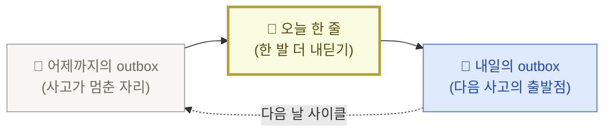

<PageIcon src="/illustrations/page-icons/pi-w2-retrieve.png" alt="오늘 한 줄 페이지 아이콘" />

# 5. 오늘 한 줄

> outbox 최신 글에 한 줄을 더하는 행위. 학습 사이클을 매일 닫는 가장 작은 단위입니다.

## "오늘 한 줄"이란

outbox의 가장 최근 글은 **어제까지의 내 사고가 멈춘 자리**입니다. "오늘 한 줄"은 그 자리에서 **한 발만 더 내딛는 행위**입니다.

- 한 단락은 부담입니다. 한 줄은 즉답에 가깝습니다.
- 첫 줄 주장이 곧 다음 글의 씨앗입니다 ([메커니즘 — outbox 3원칙](/mechanism)).
- 일주일이면 본인 사고가 어떻게 움직였는지 본인이 봅니다.

## 어제 → 오늘 한 줄 → 내일 (학습 사이클)

사이클이 닫히는 곳은 **한 줄을 적는 자리** — outbox입니다. 메일도 알림도 그 한 줄을 본인이 직접 적기 위한 준비일 뿐입니다.

## 한 줄을 끌어내는 두 호출 — 학습 행위 vs 알림

`/돌아보기`는 학습 행위, 알림 메일은 단순 알림입니다. 두 호출이 같이 묶이면 "아침에 못 돌리면 그날 학습은 망함" 패턴이 생깁니다.

| 무엇 | 언제 | 누가 트리거 |
|---|---|---|
| **`/돌아보기` 호출** (인출·메타인지 1줄 생성) | 본인이 원할 때 — PR(코드 변경 한 묶음) 한 편 끝낸 뒤·자기 전·일요일 오후. 시간 제약 X | 본인 |
| **알림 메일 도착** | 매일 아침 7시 (한국 시간). 단순 알림 | `/schedule` |

핵심은 — `/돌아보기`는 **학습 행위**라 본인이 원할 때 돌리고, **알림 메일**은 매일 아침 자동으로 옵니다. 어제 자기 전 `/돌아보기`로 만든 outbox 글이 오늘 아침 메일로 본인에게 도착하는 식입니다.

→ 메일에 무엇이 담기고 어떻게 셋업하는지는 다음 페이지에서 풀어봅니다 → [지식 대시보드 뉴스레터](/dashboard).

## 함정 — 한 줄이 단순 일기가 되는 경우

"오늘 한 줄"을 "오늘 뭘 했는가"로 적으면 어제·오늘이 연결되지 않습니다. 핵심은 **outbox 최신 글에서 한 발 더 내딛는 것**입니다. 어제 한 줄이 멈춘 자리에서 다음 한 발을 적는다는 약속입니다.

| 일기 패턴 (X) | 이어쓰기 패턴 (O) |
|---|---|
| "오늘 코드 리뷰 3개 했다" | "어제 적은 '리뷰는 코드보다 의도를 본다'에서 한 발 더 — 의도가 안 보일 때 내가 멈춘다" |
| "오늘 PKM 책 읽었다" | "어제 적은 '읽기보다 쓰기'에 묶어 — 오늘 1단락 안 쓰면 책은 안 읽은 거나 같다" |
| "오늘 회의 5개" | "어제 적은 '회의 후 한 줄'에서 한 발 — 5개 중 한 자리에서 내가 한 발 늦었다" |

판별 기준 한 줄 — **어제 outbox 최신 글의 한 단어라도 오늘 한 줄에 다시 등장하면 이어쓰기**, 아니면 일기입니다.

## 다음으로

- [지식 대시보드 뉴스레터](/dashboard) — 본인 저장소 통계·시각화 메일 셋업
- [1주일 자율 챌린지](/mission) — step-by-step으로 본인 손으로 굴려보기
