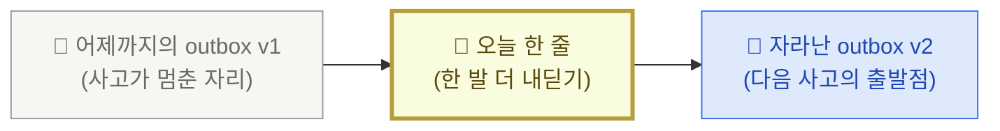

<PageIcon src="/illustrations/page-icons/pi-w2-retrieve.png" alt="오늘 한 줄 페이지 아이콘" />

# 5. 오늘 한 줄

> outbox 최신 글에 한 줄을 더하는 행위. 학습 사이클을 매일 닫는 가장 작은 단위입니다.

## "오늘 한 줄"이란

outbox의 가장 최근 글은 **어제까지의 내 사고가 멈춘 자리**입니다. "오늘 한 줄"은 그 자리에서 **한 발만 더 내딛는 행위**입니다.

- 한 단락은 부담입니다. 한 줄은 즉답에 가깝습니다.
- 첫 줄 주장이 곧 다음 글의 씨앗입니다 ([메커니즘 — outbox 3원칙](/mechanism)).
- 일주일이면 본인 사고가 어떻게 움직였는지 본인이 봅니다.

## 어제 outbox v1 → 오늘 한 줄 → 자라난 outbox v2



한 줄이 더해진 자리는 **outbox**입니다. v2가 내일의 v1이 되어 다음 한 줄을 끌어냅니다. 메일도 알림도 그 한 줄을 본인이 직접 적기 위한 준비일 뿐입니다.

## 실습 — Claude Code → 슬랙 → 본인만 있는 채널

매일 아침 "오늘 한 줄" 후보가 슬랙으로 도착하는 흐름을 본인 손으로 셋업해 봅니다. pkm-v1의 `/일일회고` 커맨드가 outbox 폴더 전체를 한 번 훑어서 어제·오늘 글에서 가장 자주 부딪힌 한 문장을 추출하고, 그 한 줄을 본인만 있는 슬랙 채널로 보내는 구조입니다.

<Callout type="tip">
"받는 행위 = 오늘의 나"가 추상적 표현이 아니라 **매일 아침 슬랙에 도착하는 메시지 한 장**으로 물리적으로 구현되는 자리입니다. 어제의 나가 outbox에 남긴 흔적을 오늘의 나가 슬랙에서 만납니다.
</Callout>

### 왜 본인만 있는 채널인가

세 가지 이유가 있습니다.

| 이유 | 무엇이 좋아지나 |
|---|---|
| 부담 없음 | 다른 사람이 보지 않으므로 매일 도착하는 메시지가 알림 피로가 아닌 본인용 ritual로 자리 잡습니다 |
| 비공개 | 본인 학습 데이터가 동료·팀과 섞이지 않습니다 |
| 시각 분리 | 업무 채널·DM과 시각적으로 분리돼 "오늘 한 줄 자리"라는 인지 앵커가 생깁니다 |

채널 이름은 `#나의-학습-에이전트` 같은 식이 자연스럽습니다.

### 시간·난이도 안내

<Callout type="info">
이 실습은 터미널·환경 변수 셋업 경험에 따라 소요 시간이 달라집니다 — **개발자는 약 30분, 비개발자는 약 1시간 + 페어 도움 권장**입니다. 셋업 4단계 중 2단계(Webhook 주소 발급)와 3단계(환경 변수 등록)에서 처음 보는 용어가 등장합니다. 막히면 옆 사람에게 화면을 보여주며 같이 따라가는 게 가장 빠릅니다.
</Callout>

### 셋업 4단계

<Steps>

#### 본인만 있는 슬랙 채널 만들기

본인 워크스페이스에서 **비공개(private) 채널**을 새로 만듭니다. 본인 한 명만 멤버로 두고, 다른 사람을 초대하지 않습니다.

#### 슬랙으로 메시지를 보낼 주소(Incoming Webhook URL) 발급

Incoming Webhook은 특정 슬랙 채널로 메시지를 보낼 수 있는 전용 주소입니다. 한 채널당 하나씩 발급받아 두면 그 주소로 메시지를 보내는 명령이 곧 그 채널에 메시지를 띄우는 동작이 됩니다.

[Slack API > Incoming Webhooks](https://api.slack.com/messaging/webhooks)에서 본인 워크스페이스에 새 webhook을 만들고, 위에서 만든 채널을 대상으로 지정합니다. 발급된 URL은 `https://hooks.slack.com/services/...` 형태입니다. 이 URL은 비밀번호 비슷한 값이라 외부에 공유하지 않습니다.

#### pkm-v1 환경 변수 등록

발급받은 URL을 본인 컴퓨터가 기억하도록 **환경 변수**로 등록합니다.

<Callout type="note">
**환경 변수**는 컴퓨터가 기억해두는 비밀번호 비슷한 값입니다. `~/.zshrc`는 본인 Mac이 터미널을 열 때마다 자동으로 읽는 설정 파일이고(`~`는 본인 홈 폴더, 앞에 `.`이 붙은 파일은 평소 숨겨져 있습니다), `source` 명령은 그 설정 파일을 다시 읽어 방금 추가한 값을 지금 바로 반영하라는 뜻입니다.
</Callout>

```bash
# ~/.zshrc 또는 ~/.bashrc에 추가
export SLACK_WEBHOOK_URL="https://hooks.slack.com/services/..."
```

`source ~/.zshrc` 한 번 실행해 방금 추가한 값을 현재 터미널에 반영합니다.

#### `/일일회고` 한 번 수동 호출

Claude Code에서 pkm-v1 폴더를 열고 `/일일회고`를 호출합니다. 슬랙 채널에 메시지 한 장이 도착하면 셋업 완료입니다.

</Steps>

### 자동화 — 매일 아침 7:30 도착

수동 호출이 정상 작동하면 스케줄(예약 시간) 등록 도구에 맡겨 매일 아침 자동으로 굴러가게 합니다. 본인 환경에 따라 두 방식 중 하나를 선택합니다. **비개발자는 GitHub Actions 쪽을 권장**합니다 — Mac이 켜져 있을 필요가 없고 plist 같은 macOS 전용 설정 파일을 다루지 않아도 됩니다.

<CardGrid columns={2}>
  <Card title="macOS launchd" icon="🍎" meta="로컬 항상 켜져 있는 경우">
    Mac이 정해진 시간마다 어떤 명령을 자동으로 실행하게 하는 macOS 기본 기능입니다. plist는 그 예약 정보를 적어두는 작은 파일이고, `~/Library/LaunchAgents/`에 plist 한 장을 두고 `launchctl load`로 등록합니다. Mac이 꺼져 있으면 동작 안 함에 유의합니다.
  </Card>
  <Card title="GitHub Actions" icon="⚙️" meta="저장소가 GitHub에 올라가 있는 경우 · 비개발자 권장">
    GitHub Actions는 본인 저장소에서 정해진 시간마다 명령을 자동으로 실행해주는 GitHub의 기본 기능입니다. `.github/workflows/` 폴더에 `.yml` 파일(예약 정보를 적는 작은 텍스트 파일) 한 장을 두면 됩니다. 예약 시간은 cron(`'30 22 * * *'` 형태로 시간을 적는 표현)으로 적는데 UTC 기준이라 한국시간 07:30은 22:30 UTC로 적습니다.
  </Card>
</CardGrid>

세부 plist·yml 예시는 [pkm-v1의 `/일일회고` 커맨드 본문](https://github.com/imakerjun/pkm-v1/blob/main/.claude/commands/%EC%9D%BC%EC%9D%BC%ED%9A%8C%EA%B3%A0.md)에 박혀 있습니다. 본인 저장소에서 그대로 참고해 셋업합니다.

### 슬랙에 도착하는 메시지 한 장

셋업이 끝나면 매일 아침 다음 형태의 메시지가 본인 채널에 도착합니다.

```text
📊 outbox 현황 (2026-05-22 기준)
- 누적 글: 12편 (이번 주 +3편)
- 어제 새 글: "수집은 학습이 아니다" (2026-05-21-지식관리의-함정.md)

✏️ 오늘 한 줄
어제·오늘 outbox에서 가장 자주 부딪힌 한 문장:
> "수집은 학습이 아니다 — 인출이 학습이다"

오늘은 이 한 줄 위에서 시작해보세요. /쓰기로 글 한 편 열기 →
```

세 줄(누적·어제·오늘 한 줄)로 시작합니다. 일주일 굴리면서 본인이 진짜 보고 싶은 데이터가 뭔지 발견하면 그때 항목을 추가합니다. 첫날부터 풀스펙으로 채우면 알림 피로가 옵니다.

### 받은 한 줄에서 오늘 시작하기

슬랙 메시지를 본 뒤 흐름은 단순합니다.

1. 슬랙의 "오늘 한 줄" 문장을 읽습니다
2. Claude Code에서 `/쓰기` 호출
3. "오늘 어떤 의도로 글을 쓰려고 해요?" 질문에 **슬랙 메시지의 한 줄을 그대로 답으로** 던집니다
4. `/쓰기`가 outbox 새 글 골격을 만들고 `.ai-wiki/index.md`에 자리만 잡아두는 한 줄(placeholder)을 박습니다
5. 본인이 본문을 채워 갑니다

이렇게 어제의 나가 outbox에 남긴 흔적이 슬랙을 거쳐 오늘의 글 시작점으로 돌아옵니다.

## 다음으로

- [지식 대시보드 뉴스레터](/dashboard) — 본인 저장소 통계·시각화 메일 셋업
- [1주일 자율 챌린지](/mission) — step-by-step으로 본인 손으로 굴려보기
